# Toaq —— 一种声调逻辑语言

公众 **beta** 版本

公布自2017/09/21.

## 前言

Toaq [tʰo.aŋ] 是一种基于谓语逻辑的造语，也是一种声调语言，即以音高变化区分语法意义。其声调之丰富使其能够极为简洁地表达事物，因为语法信息（如词性）主要是通过声调而不是单独的虚词来表达的。

Toaq 词汇一般都是先验的，尽管在少数情况下，可能从普通话和泰语等奇妙的语言中获得了一些灵感，而有些词与 Lojban 中的相应词根相似。

在造语内，Toaq 属于工化语言（engelang）分支，因其以特定的（客观上可试验的）目的而创建的。特别是，Toaq 应：

- 建立在谓词逻辑的基础上
- 通过无歧义的句法和助释规则，可无歧义地翻译成逻辑语言
- 符合规则
- 规则简单（即有少量规则）
- 运用灵活
- 简洁精炼

然而，如果不考虑语言之优雅，上述特点对作者来说意义不大。词都正在被缓慢地精心挑选以表示每一个概念，而词典也是根据逻辑的、一致性的及可扩展性的原则来设计的。对作者来说，语言之美学及底层逻辑同样重要，所以也许称 Toaq 是一种工化艺术语言会更合适。

本文档末尾的附录包含示例文本以及相同文本的录音，以及其他有用的补充。

但首先，作者希望读者能愉快阅读本文档。

## 音系学

Toaq 其音系简单，特点在于辅音丛之完全缺失。其音节元音丰富，并带有八种声调之一，使该语言具有旋律特征。

### 辅音

辅音音位有十八个。

|        | 唇   | 龈   | 硬颚   | 软腭 | 声门 |
| ------ | ---- | ---- | ------ | ---- | ---- |
| 鼻音   | m    | n    |        | ŋ    |      |
| 爆发音 | pʰ b | tʰ d |        | kʰ g |      |
| 塞擦音 |      | t͡sʰ  | t͡ɕʰ d͡ʑ |      |      |
| 擦音   | f    | s    | ɕ      |      | h    |
| 弹音   |      | ɾ    |        |      |      |
| 边音   |      | l    |        |      |      |

许多音位都有数个可替换的变体，无法使用标准发音的人可以使用。例如，任何硬颚音都可以用龈后部位的对应音来代替。

下面是一份音位—字位对应关系的清单，以及可替换发音。

| 音位  | 字位 | 可替换发音  |
| ----- | ---- | ----------- |
| /m/   | m    |             |
| /n/   | n    |             |
| /ŋ/   | q    | [ɳ] [ɲ] [ɴ] |
| /pʰ/  | p    |             |
| /b/   | b    |             |
| /tʰ/  | t    |             |
| /d/   | d    |             |
| /kʰ/  | k    |             |
| /g/   | g    |             |
| /t͡sʰ/ | c    |             |
| /t͡ɕʰ/ | ch   | [t͡ʃ]        |
| /f/   | f    |             |
| /s/   | s    |             |
| /ɕ/   | sh   | [ʃ]         |
| /h/   | h    | [x] [χ]     |
| /ɾ/   | r    | [r]         |
| /l/   | l    |             |

新：[Toaq 字母交互式键盘](http://toaq.org/letters/)

### 元音

元音音位有五：/a/, /u/, /i/, /o/, /e/.

| 字位 | 发音 | 可替换发音        |
| ---- | ---- | ----------------- |
| a    | [a]  |                   |
| u    | [u]  | 闭音节中 [ʊ]      |
| i    | [i]  | 闭音节中 [ɪ]      |
| o    | [ɔ]  | /a/ 前 [o]        |
| e    | [ɛ]  | /a/ 或 /o/ 前 [e] |

有下列复合元音：

```
/ai/, /ao/, /ui/, /oi/ (下降二合元音)
/ua/, /uo/, /ue/
/ia/, /iu/, /io/, /ie/
/oa/, /oi/, /oe/
/ea/, /ei/, /eo/
/iai/, /iao/
/uai/, /uao/
```

当 /i/ 是下降二合元音的最后部分时，它可能发音为 [ɪ] 或 [j]。

当 /o/ 是下降二合元音的最后部分时，它可能发音为 [ʊ] 或 [w]。

语音上，除了第一排的二合元音外，所有的双元音严格上都是双音节（或双音拍）（除了/ao/），但它们仍然可以作为同一音节的一部分出现，因为一个 Toaq 音节最多可以包含三个音拍，关于这一点在下一节中会有更多介绍。

元音长度不是音位特征。在缓慢而清晰的语音中，重读的元音在开音节中往往是长的，在闭音节中则短，而元音在带有中性声调的音节中一般是短的。但是将一个元音读得比一般情况长或短并不会使一个词失效。

### 音节

**注意**: [由于最近对Toaq语音组合法进行了更新，现在音节可以元音起首。](https://toaqlanguage.wordpress.com/2019/07/25/on-the-sounds-of-toaq-phonology-update/)

Toaq 音节结构基于音拍，可以通过下图进行说明。

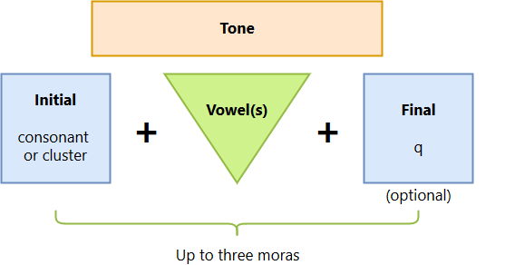

一个音节可以有一到三个音拍。在计算音拍时，起首的辅音和随后的元音算作一个音拍，其后的元音算作第二个音拍，第三个元音或最后一个辅音算作第三个音拍。

任一音节都带有八个音调中的一个。

除了 /ŋ/ 之外的任何辅音都可作音节首。辅音丛（一连串超过一个辅音的组合）不允许出现在音节首位，但可以出现在词或音节边界（/ŋ/随后有一个简单的音节首）。

音节中的元音组合受以下约束：

- 下降二合元音 (/ai/, /ao/, /ui/, /oi/) 后不能有其他元音
- /a/ 后只可有 /i/ 和 /o/
- 下降二合元音仅可作音节的首个音拍的一部分，或其前有上升二合元音/ia/, /ua/
- /o/, /e/ 后不可有二合元音
- 元音不可重复

音节尾可以是空值或 /ŋ/. 下降二合元音 (/ai/, /ao/, /ui/, /oi/) 后不可有音节尾 /ŋ/.

如上一节所述，除了下降双元音 /ai/, /ui/, /oi/ 之外，任何两个元音的组合都是双音节或双音拍。另外，强调的总是音节的首个元音，即使是上升双元音，除非该音节以一个单元音起首，后面是 /ao/，在这种情况下，/a/ 被重读。例如，puaq 的发音是 [ˈpʰu.aŋ]，而不是 [pʰu.ˈaŋ]，更不是[pʰwaŋ]；jia的发音是 [ˈd͡ʑi. a] 而不是 [d͡ʑi.ˈa] 或 [d͡ʑja]；kuao的发音是 [kʰu.ˈa.o] 或 [kʰu.ˈa.ʊ] 而不是[ˈkʰu.a.o] 或 [ˈkʰu.aʊ]。

由上述规则产生的可能的音节列表由以下表格总结：


这个表格可以像流程图一样从左到右阅读。从最左边的一列（辅音）开始，一直到与你目前所在的单元格的右边缘相邻的单元格，你将始终得到一个有效的音节。此外，一旦你到达浅绿色列的单元格，你可以在任何时候停止，因为你已经有了一个完整的音节。

这是一份关于每一种可能音节的例词清单。

| 音节 | 例词 | 发音       | 翻译                     |
| ---- | ---- | ---------- | ------------------------ |
| CV   | ji   | [d͡ʑiː]     | *"I, me, myself"*        |
| CVq  | raq  | [ɾaŋ]      | *"about, pertaining to"* |
| CVv  | jai  | [d͡ʑaj]     | *"to be happy"*          |
| CvV  | dua  | [ˈduː.a]   | *"to know"*              |
| CvVq | ruaq | [ˈɾuː.aŋ]  | *"to assert"*            |
| CVV  | keo  | [ˈkʰeː.o]  | *"but, however"*         |
| Cvai | nuai | [ˈnuː.aj]  | *"money"*                |
| Cvao | luao | [lu.ˈaː.ʊ] | *"lip"*                  |

讲 Toaq 的人不需要有意识地了解所有这些规则，除非他们想发明新的词汇，但那时他们可以参考上面的表格或用解析器来检查。然而，一个流利的说话者很可能通过接触和使用，将可能的音节及其正确的发音内化，并对什么能成为或不能成为 Toaq 音节有一个直观的认识。

## 句法

Toaq 句法是其最神奇的范畴。虽然这门语言在其核心部分几乎只由谓词组成，但正是这些音调执行了各种语法功能，创造了丰富而优雅的句法。

### 声调

**注意**：[已对声调作出更新](https://toaqlanguage.wordpress.com/2019/07/25/on-the-sounds-of-toaq-phonology-update/)。

Toaq 有八个区分意义的声调。下表列出了每个音的名称、拼写、描述其音高轮廓的图像和使用该音的例子（第一个声调与另一个声调相邻，因为它不能单独出现）。

| 平调                                   | 升调                                   | 降升调                                 | 降调                                   |
| -------------------------------------- | -------------------------------------- | -------------------------------------- | -------------------------------------- |
| ā                                      | á                                      | ǎ                                      | ả                                      |
| 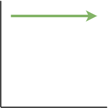 | 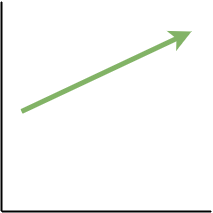 |  | 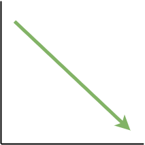 |
| **dảqmīq** *"to be eternal"*           | **pái** *"the friend"*                 | **chǐ** *"who believe"*                | **mải** *"to love"*                    |

| 升降调                                 | 低调                                   | 嘎裂声升调                             | 中性调                                 |
| -------------------------------------- | -------------------------------------- | -------------------------------------- | -------------------------------------- |
| â                                      | à                                      | ã                                      | a                                      |
| 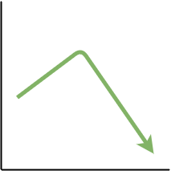 | 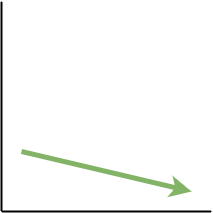 | 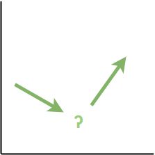 | 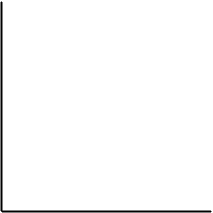 |
| **jêo** *"that it's true"*             | **tì** *"at"*                          | **fãq** *"often"*                      | **hi** *"which"*                       |

聆听音例以更好地了解每种声调的发音方式。

#### 二合元音中二声部之发音

有三个声调会经历两个阶段，中间有一个音调方向的变化。它们是降升调，升降调和嘎裂声升调。当这些声调是二合元音的一部分时，重要的是声调的下降部分要从重读的元音开始（它总是一个音节的第一个元音，除非该音节包含元音+/ao/。见音节结构部分）。

下表显示了当二合元音带有这些声调之一时应如何发音，用例是音节 neo。

| 降升调 | 升降调  | 嘎裂声升调  |
| ------ | ------- | ----------- |
| něo    | nêo     | nẽo         |
| nè + ó | né + ẻo | nè + ʔ + éo |

建议听音例。它们比声调组合方面的解释更准确，也可能更有意义。

#### 中性调的发音

中性调其特殊之处在于没有普遍正确的发音。一般来说，带中性调的音节没有重音，比其他音节更轻更短，但更重要的是，它们在音高方面的发音取决于前一个音节的声调。也可以说，前七个声调是绝对声调，第八个声调是相对声调。

下表显示了中性调（灰色）在七个主要声调（绿色）之后的发音情况。

| 1 + 8                                                        | 2 + 8                                                        | 3 + 8                                                        | 4 + 8                                                        |
| ------------------------------------------------------------ | ------------------------------------------------------------ | ------------------------------------------------------------ | ------------------------------------------------------------ |
| 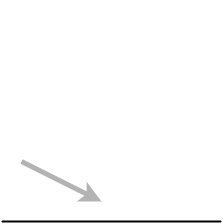 | 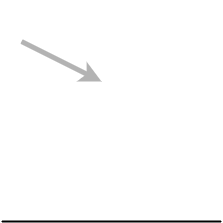 |  | 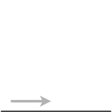 |
| **Tỉ<u>shā da</u>.** *"There's an arrival taking place."*    | **súq bi** *"as for you..."*                                 | **tǎo na** *"those who act"*                                 | **Jải ba.** *"May there be happiness."*                      |

| 5 + 8                                                        | 6 + 8                                                        | 7 + 8                                                        | 8 + 8                                                        |
| ------------------------------------------------------------ | ------------------------------------------------------------ | ------------------------------------------------------------ | ------------------------------------------------------------ |
|  |  |  | 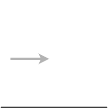 |
| **<u>dâi tu</u> rái** *"that anything is possible"*          | **<u>tì sa</u> rái** *"somewhere"*                           | **dǔa <u>bũ na</u>** *"those who do not know"*               | **jí <u>ru sa</u> pái** *"me and some friends"*              |

应该注意的是，不需要过度矫正中性调的发音，只要发音不可与第一个声调混淆。其原因稍后将变得显而易见。

### 声调功能

上一节中介绍的音调都有非常具体的功能。它们的工作是指定一个给定的词属于哪个词类。每个音调都对应一个不同的词类。下表列出了这些对应关系：

| 声调# | 调名       | Unicode | ASCII | 功能     |
| ----- | ---------- | ------- | ----- | -------- |
| 1     | 平调       | ā       | a-    | 复合     |
| 2     | 升调       | á       | a/    | 论元短语 |
| 3     | 降升调     | ǎ       | aV    | 关系从句 |
| 4     | 降调       | ả       | a?    | 谓词短语 |
| 5     | 升降调     | â       | a^    | 内容从句 |
| 6     | 低调       | à       | a\    | 介词     |
| 7     | 嘎裂声升调 | ã       | a~    | 状语短语 |
| 8     | 中性调     | a       | a     | 助词     |

除了写 ASCII 声调标记外，还可以在一个音节后面写上声调数字来表示它的声调。

当一个词的第一个音节带有这些音调之一时，它就标志着一个相应的新短语的开始。例如，一个带升调的词成为（或开始）一个论元短语（名词），一个带降调的词成为（或开始）一个谓语词组（动词），诸如此类。

音调1至7只适用于谓词。任何一个谓词都可以带有这七个声调中的任何一个，每个声调产生不同的词类。

另一方面，第8个音调（中性音）只能出现在功能词中（即不是谓语词的每个词）。谓语词永远不可能带有中性调。

通常情况下，前面音节的声调会影响中性声调的功能词的发音，如上节所示。

与许多自然语言中的声调不同，不同的声调标志着不同的词汇项，而 Toaq 中的声调从不改变一个词的词法含义，因此即使说话者把声调弄错了，听者仍能大致了解句子的内容，只需猜测不同部分在句法上的关系。

不同声调和它们创造的词类将在后面的章节中详细讨论。

### 句子结构

Toaq 中的句子结构一般遵循以下模式：

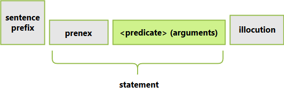

如图所示，一个句子有四个部分，用方框表示。灰色背景的方框是可选项，而绿色方框是必须项。在绿框中，只有谓语是必须的。论元可能出现，也可能不出现。这意味着最简单的可能句子是一个裸谓语。

尽管句前缀（sentence prefix）、前束词（prenex）和语为（illocution）不需明显提供，但只有前两者在逻辑上可以缺失，而语为总是要出现，哪怕只是隐含的。在没有明确说明的情况下，它被认为是默认的表述句式（assertive）。

所有这些都将在其专门的章节中进行更详细的研究。现在，一些例子将说明Toaq句子的不同复杂程度。

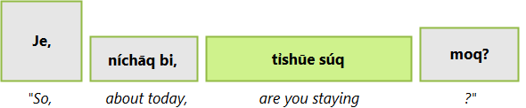

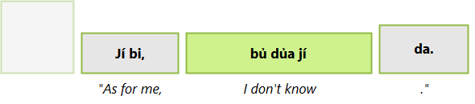

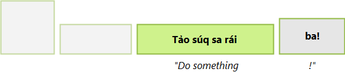


这些含义是如何产生的，将在后面的章节中讨论。现在，只需记住Toaq句子的模块化特征。

### 片段性句子

在自发的讲话中，人类并不总是做出完整句子。有时，单独说出一个名词就足够了，也许是为了回答一个问题，或者是在进行观察时。有时，我们以一种方式开始一个句子，然后发现自己不想以同样的方式继续下去，从而导致我们重新开始，等等。为了解释语言使用中的人为因素，Toaq 允许某些东西以孤立的方式说出，以构成所谓的片段性句子（fragmental sentences）。

几乎任何类型的短语都允许作为片段：

- 许多术语，即具体论元、内容从句、副词和介词短语；
- 关系从句；
- 裸前束词；
- 许多自由修饰词。

以下是片段性句子的示例：

| 片段一 | nèo	tóqfūa    | 片段二 | níchāq	bi ...    | 片段三 | hu	mí Jỏsēfō! |
| ------ | ---------------- | ------ | ------------------- | ------ | ---------------- |
|        | on	table      |        | today	END.PRE    |        | voc	Joseph    |
|        | *"on the table"* |        | *"about today ..."* |        | *"Hey, Joseph!"* |

需要注意的是，虽然片段性句子作为话语的一部分是有效的，但语句必须始终是完整的，这要求它至少包含一个谓词。句子（和片段性句子）存在于话语层面，而语句是任何完整句子的一部分，是出现在子句中的内容。关于这一点，在关系从句章节和内容句子章节有更多的介绍。

### 谓词短语

谓词是任何围绕着谓词逻辑建立的语言的一部分和组成部分。Toaq 试图提供有规律的位置结构模式。相似主题的谓词具有平行的位置结构。

Toaq中的谓词是多级的；每个谓语词实际上是一系列相关的谓语，在其元数上有所不同。这意味着什么呢？让我们考虑一下谓语词 **fai** *"often"*。

```
fai : ___ occurs frequently/often; ___ frequently satisfies property ___.
```

这就是字典可能会列出单词的方式。 **fai** 实际上是一个谓词族，其确切定义取决于提供给它的论元的数量，在 **fai** 的情况下是一个或两个（或零）个论元。可以这样写：

```
fai₁ : ___ occurs frequently/often.

fai₂ : ___ frequently satisfies property ___.
```

两个同名的不同谓词，它们在涉及的论元数量上有所不同。在一个谓词中应用哪一个，取决于提供多少个论元。如果只提供一个论元，那么就使用一元定义。如果有两个论元，那么就使用二元定义，以此类推。

| 谓词一 | Chủq	jí	chókō.       | 谓词二 | Chủq	jí.      |
| ------ | -------------------------- | ------ | ---------------- |
|        | eat	I	chocolate      |        | eat	I         |
|        | *"I am eating chocolate."* |        | *"I am eating."* |

对于一些谓词来说，不同元数之间的差异是非常小的，比如低元数版本只是缺少低元数版本后面的论元位置（如上面的 **chuq** *"eat"*），但有时，如上面的 **fai** *"often"* 这样的词，论元类型在数位之间会发生变化。

Toaq 中的谓词范围从零元到 n元（大多数谓词不超过三个论元位置，而只有非常少谓词的时候才会达到四个）。零元谓词的定义通常不在词典中给出，因为它总是可以预测的。对于任何一个谓词*X*来说，在没有提供任何论元的情况下对其进行谓词化，会产生类似于「有行动*X*在进行中」（如，有人正在*X*）的意思。

| 谓词三 | Sủaq	da.                    |
| ------ | ------------------------------ |
|        | sing	ASS                    |
|        | *"There is singing going on."* |

谓词意义随其元数而变化这一事实对否定也有重要影响。当一个非最大元数的谓词被否定时，它意味着较高元数的版本也不能为真。**chủq jí** (*"I eat"*)的否定意味着**不存在进食事件而其中我是吃者**(换句话说，我不吃**任何东西**)，而 **chủq** (*"There is eating going on"*)的否定意味着在讨论下的时间及地点根本没有进食事件发生(换句话说，没人在吃东西)。

谓词短语有许多结构和形式，从简单的单词短语到复杂的多词短语。这些不同种类的谓语短语将在以下章节中讨论。

#### 简单谓词

简单谓词是最基本的一种谓词短语。

| 词   | +    | ◌̉    | =    | 谓词 |
| ---- | ---- | ---- | ---- | ---- |

简单谓词由在其第一个音节上带有降调的单个谓词组成。例如，**poq** + ◌̉ = **pỏq** *"to be a person"*。

| 简谓一 | <u>Jải</u>	jí	da. | 简谓二 | <u>Mải</u>	jí	súq. | 简谓三 | Mả	<u>pải</u>	súq	jí	moq?     |
| ------ | ----------------------- | ------ | ------------------------ | ------ | ----------------------------------------- |
|        | be.happy	I	ASS    |        | love	I	you         |        | whether	be.a.friend	you	I	INT |
|        | *"I am happy."*         |        | *"I love you."*          |        | *"Are you my friend?"*                    |

简单谓词非常常见，但远不是唯一的谓词种类。通常情况下，它们作为更复杂的谓词的构件发挥作用，如序列谓词。

#### 序列谓词

可结合多个单独谓词，以形成具有常规语义的序列谓词。在一个序列复合词中，相邻的谓词的位置结构合并成为一个新的谓词。

| 谓词 | +    | 谓词 | =    | 序列谓词 |
| ---- | ---- | ---- | ---- | -------- |

使用一个非常基本的示例来引导读者了解序列谓词的概念：

| 序谓一 | <u>Jảq</u>	<u>dẻ</u>	súq	da.    |
| ------ | ---------------------------------------- |
|        | be.extreme	be.beautiful	you	ASS |
|        | *"You are very beautiful."*              |

为什么序谓一是这个意思呢？其中的序列谓词分解为以下谓词：

```
jaq₂ : ___ is extremely/very ___ (property).
de₁ : ___ is beautiful.
```

在一个序列谓词中，当第一个谓词的第二个论元位置是一个属性或命题时，该位置与第二个谓词的第一个论元位置对齐，两个谓词在这一点上被合并：


因此，**jảq dẻ** 的定义是 *"___ is very beautiful"*（或用自然语言来说，*"to be very beautiful"*）。

另例：**sủai fả**

| 序谓二 | Sủai	fả	súq	ba!     |
| ------ | ---------------------------- |
|        | be.quick	go	you	IMP |
|        | *"Go quickly!"*              |

具体情况如下：

```
suai₂ : ___ quickly does ___ (property).
fa₂ : ___ goes to ___.
```

对齐与合并：


因此，**sủai fả** 的定义是 *"__ quickly goes to __"*（或者，*"to quickly go somewhere"*）。

在一个序列谓词中，可无限制地组合任意数量的谓词；它们只需要有意义即可；序谓三展现了一个三方的序列谓词。

| 序谓三 | Dải	jỉa	nỉqdūa	púqhō.                      |
| ------ | --------------------------------------------------- |
|        | be.possible	be.in.future	discover	they     |
|        | *"It is possible that they will make a discovery."* |

序列谓词是以右分组的。每个谓词成分管辖其后所有谓词。例如，一个形式为$A\ B\ C\ D$的序列谓词将被分组为$(A (B (C\ D)))$。在序谓四中，分组通过括号明确显示。

| 序谓四 | ( Bủ	( pủ	( bỉaq	mải ) ) )	líqdēo	jí.  |
| ------ | ----------------------------------------------------- |
|        | be.false	be.past	be.enough	love	girl	I |
|        | *"The girl did not love me enough."*                  |

当第一个谓词的第二个论元位是一个命题时，对齐及合并的工作方式略有不同。

```
tua₂ : ___ makes ___ happen.

siq₁ : ___ is clean.
```

对齐及合并：


| 序谓五 | Tủa	sỉq	jí	tóqfūa.           |
| ------ | ------------------------------------- |
|        | make.happen	be.clean	I	table |
|        | *"I clean the table."*                |

到目前为止，只讨论了第一个谓词在其第二个论元处允许有子句的序列谓词。还有第二种类型的序列谓词，即第一个谓词是一个一元谓词的情况。这种情况的表现让人想起英语中的形容词。

| 序谓六 | Sảo	rủa	ní.             |
| ------ | ----------------------------- |
|        | be.large	be.flower	this |
|        | *"That is a large flower!"*   |

一个像 **sảo rủa** 这样的谓词短语的表现就像它的组成部分被连词 **ru** *"and"* 连接起来一样。换句话说，**sảo rủa** *"to be a large flower"* 被解释为 **sảo ru rủa** *"to be large and a flower"*。后者的结构在连接词部分有更详细的介绍。

| 序谓七 | Mủaqshō	géo	nảqrēq	na,	ru	shủe	mỉe	nío	lỉqdēo. |
| ------ | ------------------------------------------------------------ |
|        | die	old	be.man	ASS	and	remain	live	young	girl |
|        | *"The old man dies, the young girl lives."*                  |

#### 名称

Toaq 中，名称都是谓词。对于任何名称*X*，相应的谓词有这样的定义：*"___ is called X"*。这个*X*必须是一个任意长度的有效音节字串。如果这个名字不是原生Toaq词，而且它的形式如果直接导入会违反Toaq语音规则，则须调整以适应之。

| 名一 | Mỉ Jỏq	jí	da.       | 名二 | Mỉ Sảrā	ní	da.         |
| ---- | ------------------------- | ---- | ---------------------------- |
|      | be.named.John	I	ASS |      | be.named.Sara	this	ASS |
|      | *"I am John."*            |      | *"This is Sara."*            |

在名一和名二中，**mi** 后面的名称带有一个降调。它也可以带有任何其他音调。当名称的音调开始的短语结束时，词则自动结束。

**mi *X***形式的名称谓词的行为与其他谓词完全一样。任何可以在谓词上执行的转换也可以在名称谓词上执行。

最常见地，视作一个论元：

| 名三 | Fả	mí Hẻlēnā	núidōaq. |
| ---- | --------------------------- |
|      | goes	Helena	town      |
|      | *"Helena goes to town."*    |

可被量化：

| 名四 | Bủa	sa	jó	mỉ Mảrīa	ní	jỉo.                  |
| ---- | ---------------------------------------------------------- |
|      | inhabit	some	four	be.Maria	this	be.building |
|      | *"Four Marias live in this building."*                     |

可以附加关系从句诸：

| 名五 | Mí Pỉtā	pǔ	gẻq	súq	hóa	pa	pải	jí.       |
| ---- | ------------------------------------------------------------ |
|      | Peter	who.did	meet	you	him	END	be.friend	I |
|      | *"The Peter you met is my friend."*                          |

当然，它也可以用于序列谓词以及可使用谓词的任何其他地方。

#### 引语

Toaq有两种引语。单语引语和全文引语。前一种类型的工作方式很像名称，但不是在引用的短语前加 **mi**，而是使用前缀 **shu**。

```
shu : turns following phrase X into predicate with definition "___ is the word/expression X".
```

| 引一 | Jảq	dẻ	shú núai                  |
| ---- | -------------------------------------- |
|      | very	beautiful	'nuai'            |
|      | *"The word 'nuai' is very beautiful."* |

如果没有 **shu**，这句话的意思是 *"The money is very beautiful"*（**nuai** *"money"*）。

| 引二 | Pủ	kủqshāo	jí	shú nủofūa.  |
| ---- | ----------------------------------- |
|      | did	mean.to.say	I	'nuofua' |
|      | *"I meant to say 'bed'."*           |

另一种引语是全文引语。通过它，可以引用整个话语（即任何数量的完整或片段性句子）。由于与单语引语不同，引语不会自动终止于一个短语的末尾，这种引语类型需要在被引文本周围有明确的括号。其结果是一个指向被引用文本的谓词。

```
mo : begin full-text quote.

teo : terminate full-text quote.
```

| 引三 | Pủ	kủq	jí	mó	«  tỉ	núai	hi	rái	moq? »	teo. |
| ---- | ------------------------------------------------------------ |
|      | did	say	I	[quote]	be.at	money	which	anything	INT	[unquote] |
|      | *"I said 'where is the money?'."*                            |

#### 复合谓词

复合谓词是 Toaq 能够扩展其词汇的方式之一。

| 音节 + 音节 | +    | ◌̄    | =    | 复合谓词 |
| ----------- | ---- | ---- | ---- | -------- |

复合谓词至少由两个音节组成，除了第一个音节外，所有音节都带有平调。例如，**naqdēo** *"to be a boy"*，**nichāq** *"to be today"* 和 **tijāo** *"to be far away"*。

复合谓词算作单个词，因此书写时没有空格。

复合谓词派生自较小的部分（通常是其他词根）是很常见的，尽管不是强制性的（请参阅借用章节）。

以 **tijāo** *"to be far away"* 这个词为例。这个词由 **ti** *"to be somewhere"* 和 **jao** *"to be far"* 两个词派生而来。

```
jao₃ : ___ is far from ___ in property ___.

ti₂ : ___ is at ___.
```

**jao** 这个词单独表达任何种类的远，并不限于空间距离（例如，某物在时间上也可以是远的）。为了创造一个专门表达空间意义上的谓语 *"far away"*，该谓语与表示空间成分的词 **ti** 复合在一起：某物与另一物的距离就其所在的位置而言是远的。这就产生了新词 **tijāo** *"to be far away (spatially)"*，它在词典中构成一个单独的条目。

使用这种方法，就有可能从Toaq有些简约的词根列表中推导出成千上万的新概念。

正如前面所暗示的，复合谓语不一定是基于其他Toaq根词。如果不是这样，那就是在处理借用的问题。

#### 借用

尽管Toaq提供了一种非常有效的方法，通过组合现有的词汇来创造新的词汇，但有时也希望从其他语言中获取词汇。

不能指望Toaq的本地词根列表能涵盖人类思想的全部。新的概念和想法不断出现，每一个科学的新发现都需要新术语。此外，一些语言和文化使用特定的当地概念，这些概念可能很难用托克语的本地词根来呈现，而直接复制它们就容易多了。类似的事情也可以适用于行话术语。

从机制上讲，借用的工作方式与普通的复合谓词一样。不同的是，部分或全部成分来自另一种语言。

因此，创建一个借用是很直接的。要借入的词其形式必须进行调整，以适应Toaq语音组合法。接下来，可以选择将借入的形式与Toaq词根进行复合，从而增加语义提示。

比如说，我们想创造一个关于Sala花的词。**Sala** 这个词已经有了正确语音结构。再加上词根 **rua** *"flower"*，就会得到 **salāruā** *"to be a Sala flower"*。

添加原生词根构件发挥两方面的功能：

- 它对不熟悉该词的人起到了提示作用。
- 它保留了在另一种语言中具有相同语音结构的其他词语也被导入的可能性。

有些借词非常普遍，以至于失去了原生Toaq词根成分。其中一个例子是 **chokō** *"to be chocolate"*。

#### 人称指代谓词

Toaq代词并非默认为名词，而是相当于代词的谓词。

| 谓词       | 含义                          |
| ---------- | ----------------------------- |
| **ji**     | ___ is me (the speaker).      |
| **suq**    | ___ is you (the listener(s)). |
| **ho**     | ___ is him/her/them.          |
| **maq**    | ___ is it.                    |
| **puqjī**  | ___ is us (1p+3p).            |
| **suqjī**  | ___ is us (1p+2p).            |
| **puqhō**  | ___ is them.                  |
| **puqmāq** | ___ are those things.         |
| **ni**     | ___ is this/that/these.       |
| **nu**     | ___ is such / like this/that. |
| **nijūi**  | ___ is this nearby thing.     |
| **nijāo**  | ___ is that far away thing.   |

人称指代谓词最常见用作论元（有关如何使用谓词作为论元的详细信息，请参阅论元短语一章），但它们可以用于任何可以使用谓词短语的情况。

指示谓词也常见于序列谓词中：

| 人称一 | Mả	dỉ	chủq	jí	ní	hảq	moq?                 |
| ------ | ----------------------------------------------------------- |
|        | whether	be.allowed	eat	I	this	be.food	INT |
|        | *"May I eat this food?"*                                    |

#### 数

该章节中的数是关于谓语的？为什么是！ 「一切都是谓词」是有原因的座右铭。就像其他一切一样，数是谓词。

Toaq 默认使用十进制系统。十个基数如下：

| 数字 | 发音   |
| ---- | ------ |
| 1    | shi    |
| 2    | gu     |
| 3    | saq    |
| 4    | jo     |
| 5    | fe     |
| 6    | ci     |
| 7    | diai   |
| 8    | roai   |
| 9    | nei    |
| 0    | puisia |

由于数是谓词，因此其必有位结构。

作为独立谓词，与数 *n* 对应的谓词具有以下含义：

```
n : x1 are n in number.
```

例如：

| 数一 | Shỉ	jí	da.	Gủ	súqjī	da. |
| ---- | -------------------------------------- |
|      | one	I	ASS	two	we	ASS    |
|      | *"I am one. We are two."*              |

为了生成更大的数字，可以通过并列单个数来创建复合谓词：

| 数二 | Nỉe	sa	héıjō	pỏq	kúa.              |
| ---- | ---------------------------------------------- |
|      | be.inside	some	14	be.person	room   |
|      | *"There are fourteen people inside the room."* |

但是，还有一些方法可以更清楚地标记数十、数百和数千（请参阅下一节）。

#### 更大的数

| 数字 | 发音 |
| :--- | :--- |
| 10   | hei  |
| 100  | fue  |
| 1000 | biq  |

这些谓语可以与数字结合，构成十、百、千的倍数。

| 数三 | saqhēi,	shifūe,	jobīq,	gubīqsāqfūejōhēishī          |
| ---- | ------------------------------------------------------------ |
|      | 30	100	4000	2341                                    |
|      | *"thirty, one hundred, four thousand, two thousand three hundred fourty-one"* |

#### 模糊数量

模糊数量是像 *"many"* 和 *"enough"* 这样的数量。这些也是Toaq的谓词。

| 数量     | 谓词     |
| :------- | :------- |
| all      | tuq      |
| most     | soq pủi  |
| many     | pủi      |
| few      | tuao pủi |
| enough   | biaq pủi |
| too many | dui pủi  |

| 量一 | Tủao	pủi	kóemēa.         |
| ---- | ------------------------------ |
|      | be.little	be.many	option |
|      | *"The options are few."*       |

#### 序数

序数（「第一」、「第二」、「第三」等）是基于谓词 **ko** 的简单序列谓词：

```
ko : ___ is the xth among ___ where x is the cardinality of anything that satisfies property ___, sorted by property ___.
```

例如：

| 序一 | Kỏ	shỉ	jí	láo.                     |
| ---- | ------------------------------------------- |
|      | nth	be.one	I	wait-er               |
|      | *"I am first among those who are waiting."* |

#### 谓词化助词

本节将讨论以下助词：

```
jei : sameness predicatizer. converts the following argument phrase X into a predicate with the definition "___ is/are X"

po : associative predicatizer. converts the following argument phrase X into a predicate with the definition "___ is/are X's"
```

尽管谓词几乎无处不在并且我们通常从它们转换而来，但有时将论元短语转换回谓词是方便的，甚至是必要的。这是使用谓词化助词完成的。

| 谓化一 | Jẻi mí Chảq	múaqtūa	da. |
| ------ | ----------------------------- |
|        | be.Chang	killer	ASS     |
|        | *"The killer is Chang."*      |

单词 **po** 用于从任意论元中创建所有格谓词。

| 谓化二 | Pỏ jí	ní	da.     |
| ------ | ---------------------- |
|        | be.mine	this	ASS |
|        | "This is mine."        |

由于 **po** + 论元是谓词，所以也常用于序列谓词：

| 谓化三 | Gẻaq	pó súq ga	tỏqfūa	kùi	hi	rái	moq?      |
| ------ | ------------------------------------------------------------ |
|        | be.dirty	your	table	because	which	anything	INT |
|        | *"Why is your table dirty?"*                                 |

### 术语

术语是一种有句法动机的范畴。它们包括各种词类，包括论元短语和介词短语。作为术语的分类在后面讨论术语集的时候会很有用；术语是所有可以在术语集中连接的东西。

#### 论元短语

论元短语是用作谓词论元的短语。有两种论元短语：具体论元和内容从句。

##### 具体论元

| 词   | +    | ◌́    | =    | 具体论元 |
| ---- | ---- | ---- | ---- | -------- |

具体论元通过在谓词的首音节上应用升调来创造。例如，**poq** + ◌́ = **póq** *"the person(s)"*.

当谓词转化为论元时，产生的表达指的是满足转化后的谓词的首个论元位置的事物。为理解这一点，任何简单方法是想象在应用升调时，在谓词定义的前面有*"something that ..."* 这句话。

| Predicate | Definition         | + ◌́                    | Result                                      |
| :-------- | :----------------- | :--------------------- | :------------------------------------------ |
| **poq**   | ___ is a person.   |                        | **póq** *"the person(s)"*                   |
| **dua₁**  | ___ has knowledge. | *"something that ..."* | **dúa** *"the knower(s)", "those who know"* |
| **gi**    | ___ is good.       |                        | **gí** *"the good thing(s)"*                |

Toaq论元短语都没有标记语法数。像 **póq** *"the person(s)"* 这样的表达可以指代一个人或多个人。数谓词可以用来明确显示一个表达所指事物的数量。

为方便起见，这里重复表达单数和复数的方法。

| 论短一 | Dủi	nủi	shí	tủifūa.               |
| :----- | :----------------------------------------- |
|        | be.too.much	be.small	one	be.chair |
|        | *"The [one] chair is too small."*          |

谓词 *shi* *"to be one in number"*  被加在待转换的谓词前，从而形成序列谓词，保证确切地指一个东西。复数的对应词用谓词 **puq** *"to be multiple things"* 来表达：

| 论短二 | Tủa tỉ	jí	púq	tủifūa	háqbāikūa.     |
| ------ | ----------------------------------------------- |
|        | put	I	the.multiple	be.chair	kitchen |
|        | *"I put the chairs in the kitchen."*            |

##### 内容从句

第二种论元短语是内容从句。当一个语句要放在另一个语句里时，就需要这些内容从句。在 *"I know [that] you like me"* 这个句子中，子陈述 *"[that] you like me"* 是一个内容从句，作为谓语 *"know"* 的第二个论元。

| 词   | +    | ◌̂    | =    | 内容从句 |
| ---- | ---- | ---- | ---- | -------- |

内容句是通过在谓语的首音节上使用升降调来创建的。这时，一个新的从句就开始了，这样转换后的谓词就成为该从句的谓词。例如，**cho** + ◌̂ = **chô jí súq** *"that I like you", "the fact that I like you"*。

| 内从一 | Dủa	jí	chô	súq	jí.     |
| ------ | ---------------------------------- |
|        | know	I	that.like	you	I |
|        | *"I know that you like me."*       |

内容从句是放在另一个语句中的语句。它们不是句子，因此既不能用句子前缀，也不能以语为标记结句。在（内从二）中，语为标记适用于整个句子。

| 内从二 | Mả	dủa	súq	nâokūa	tì hi rái	moq?            |
| ------ | ---------------------------------------------------------- |
|        | whether	know	you	that.is.bathroom	where	INT |
|        | *"Do you know where there is a bathroom?"*                 |

任何语句都可以以助词 **na** 结束。最常见的用法是结束一个内容从句或相对从句，使随后的术语不再适用于从句，而是适用于它所嵌入的语句。

| 内从三 | Rủaq	súq	tî	súq	nírīaq	na	rào	púchāq.   |
| ------ | ------------------------------------------------------------ |
|        | assert	you	that.be.at	you	here	END	when	yesterday |
|        | *"You asserted that you were here yesterday."*               |

在（内从三）中，介词短语 **rào púchāq** *"yesterday"* 在由 **tî** 开始的内容从句之外，因为它在终止助词 **na** 之后。因此，该句子的意思是，该断言发生在昨天。如果没有 **na**，这个句子的意思是听话者昨天就在这里，而断言的时间则是不明确的。

##### 属性

属性是一种特殊的内容从句。从语法上讲，它们的工作原理如上所述，但不同的是，它们是开放语句，即它们至少包含一个开放词位。该开放词位由一个特殊的变量标记，特别是由lambda量词λ所约束的变量，由助词 **ja** 表示。

本节只是要展示一个简单的例子。关于量词和前束词的更详细的解释可以在后面的章节中找到。

需要用属性来填补许多论元位置，如 **leo** *"to try"* 一词的第二个论元位置：

```
leo : ___ tries to satisfy property ___.
```

第二个论元位置应填入一个属性从句，如 "X helps"。

| 属从一 | Lẻo	jí	sôa	ja	dó.                                |
| ------ | ------------------------------------------------------------ |
|        | try	I	that.help	λ	X                              |
|        | *"I try to help."* (lit. *"I try to satisfy the property [X helps]."*) |

当属性从句非常简单时，以一个等价的序列谓词代替是更常见的方法。

| 属从二 | Lẻo	sỏa	jí.  |
| ------ | ------------------ |
|        | try	help	I   |
|        | *"I try to help."* |

只有当更复杂的逻辑应该被放在属性的范围内时，才需要属性从句。

| 属从三 | Tảoshāo	hó	lî	ja	dó	bi	kảqgāi	páo	tâi	dó |
| ------ | ------------------------------------------------------------ |
|        | intend	they	property	λ	X	prenex	see	parent	succeed	X |
|        | *"They intend to make [their] parents see them succeed."*    |

**li** 这个词的作用是明确标记一个「开放语句」，也就是说，它预示着一个属性即将到来。（参见语句前缀章节）。

##### 关系从句

如果没有一个涉及关系从句的章节，论元短语的章节就不完整了。关系从句跟随它们所修饰的论元。

| 词   | +    | ◌̌    | =    | 关系从句 |
| ---- | ---- | ---- | ---- | -------- |

通过在谓词的首音节上使用降升调来创建一个关系从句。这时，一个新的从句就开始了，这样转换后的谓词就作为谓词从句发挥作用。例如，**jai** + ◌̌ = **jǎi** *"who is happy"*。

| 关从一 | Mả	kảqgāi	súq	púq dẻo	lǔaq	tì	sóaq	moq? |
| ------ | ------------------------------------------------------------ |
|        | whether	see	you	children	who.play	at	garden	INT |
|        | *"Do you see the children who are playing in the garden?"*   |

关系从句可通过助词 **na** 明确地结束。最常见的使用情况是防止任何随后术语适用于从句，而让它适用于它所嵌入的语句。

| 关从二 | Kảqsī	sa póq	chǔq	hóa	na	jí	da.       |
| ------ | ------------------------------------------------------- |
|        | look.at	someone	who.eat	PRO	END	I	ASS |
|        | *"Someone who is eating is looking at me."*             |

在（关从二）中，论元 **jí** *"I"* 在由chǔq开始的相对句之外，因为它在终止助词 **na** 之后。如果没有**na**，这个句子的意思就是有人在吃我而在看某物，因为 **jí** 会成为 **chuq** 的第二个论元。

还要注意 **hoa** 这个词的存在。这是一个特殊代词，专门用于关系从句中。其前置词是它所在的关系从句的中心词。这个代词的存在使我们有可能将中心词（名词）深嵌相对句中，而不必重新安排词序。

| 关从三 | Mả	tỉ	sa rái	dǎi	jêa	jí	hóa	moq?        |
| ------ | ------------------------------------------------------------ |
|        | whether	is.at	something	which.be.possible	that.buy	I	PRO	INT |
|        | *"Is there anything there that I could buy?"*                |

在复杂程度的另一面，关系从句的谓词也可以用零论元提供。由于每个相对句子都必须在某种程度上与它的中心词有关，所以在这种情况下，代词 **hoa** 被假定在谓语的第一个论元位置。这是一个有用的简替形式，可以经常利用，如例子关从一中的情况。

##### 连系词

连系词是一小群组词，用于标记随后的论元短语应放在哪个论元词位中。在没有标记的情况下，一个论元短语总是放在编号最低的未填充位。使用连词，这个顺序可以被操纵。

| 连系词 | 位置 |
| :----- | :--- |
| **fi** | 1    |
| **go** | 2    |
| **cu** | 3    |
| **ta** | 4    |

| 连系一 | Bỏdōa	jí	cu	hó	ní tỉai.        |
| ------ | ------------------------------------------ |
|        | give	I	3rd.place	they	this.box |
|        | *"I give to them this box."*               |

#### 介词短语

不像英语，其介词是功能词的封闭类，Toaq的介词可有系统地派生自任意谓词，通过简单地应用恰当的声调。

| 词   | +    | ◌̀    | =    | 介词 |
| ---- | ---- | ---- | ---- | ---- |

介词以应用低调于任意谓词的首音节创建。例如，**raq** + ◌̀ = **ràq** *"about"*.

介词后面必须有一个论元短语（具体论元或内容从句）。其整体就是一个介词短语。介词短语可以在一个语句中或多或少地自由移动。

将一个谓词转换为介词的逻辑效果是，包含它的语句被要求满足谓语的第一个论元位置，而介词的补语则满足第二个论元。

| 介短一 | Nủo	jí	tì	sóaq.   | 介短二 | Tỉ	nûo	jí	na	sóaq.            |
| ------ | -------------------------- | ------ | ----------------------------------------- |
|        | sleep	I	at	garden |        | be.at	that.sleep	I	end	garden |
|        | *"I sleep in the garden."* |        | *"My sleeping is in the garden."*         |

介短一等价于介短二。

请注意，原来的主语句（**nủo jí** *"I sleep"*）变成了 **ti** *"to be at"*（原来是介词）的第一个论元，而原来是介词的补语（**sóaq** *"the garden"*）变成了第二个论元。这就是所有介词在表面下的工作方式。

下表仅仅列出了一部分无限多可能派生的介词：

|   介词    |   介词含义    |               谓语含义                |                           用例                            |
| :-------: | :-----------: | :-----------------------------------: | :-------------------------------------------------------: |
|  **ràq**  |   *"about"*   |          ___ pertains to ___          |           **ràq sa shí nảqdēo** *"about a boy"*           |
|  **gào**  |   *"above"*   |           ___ is above ___            |           **gào púq pủao** *"above the clouds"*           |
|  **bìe**  |   *"after"*   |         ___ occurs after ___          |              **bìe hôaq** *"after the fire"*              |
|  **tì**   |    *"at"*     |             ___ is at ___             | **tì sâojēaq púai sảbātūa** *"where the wild roses grow"* |
|  **kùi**  |  *"because"*  |     ___ is the case because ___.      |         **kùi mâi jí súq** *"because I love you"*         |
| **shìu**  |  *"before"*   |  ___ is before / in the past of ___.  |           **shìu núaqchū** *"before midnight"*            |
|  **tìa**  |  *"behind"*   |          ___ is behind ___.           |             **tìa múao** *"behind the tree"*              |
|  **rào**  | *"at (when)"* | ___ happens at the same time as ___.  |          **rào kâqgāi jí máq** *"when I saw it"*          |
|  **nìe**  |    *"in"*     |          ___ is inside ___.           |            **nìe búajīo** *"inside the house"*            |
| **tìjūi** |   *"near"*    | ___ is near / in the vicinity of ___. |            **tìjūi gúaqnāo** *"near the lake"*            |

当一个句子中出现一个以上的介词（或副词）时，它们相互之间的出现顺序就开始变得重要了。

介词管辖其右边的介词（和副词）。这意味着在确定哪个介词最终成为另一个介词的论元时（使用从介短一到介短二的转换规则），先出现的介词优先，其右边的介词成为其论元。

#### 副词

Toaq的副词与其介词短语有非常密切的关系。事实上，两者之间唯一的区别是副词不带补语。

| 词   | +    | ◌̃    | =    | 副词 |
| ---- | ---- | ---- | ---- | ---- |

副词是通过在谓语的首音节上使用嘎裂声升调来创造的。例如，**fai** + ◌̃ = **fãi** *"often"*。

像介词一样，副词可以在语句中自由移动。

将一个谓语转换为副词的逻辑效果是，包含它的语句被要求满足谓语的第一个论元位置。

| 副词一 | Tỉshūe	hó	fãi	pó jí ga	bủajīo. | 副词二 | Fải	tîshūe	hó	pó jí ga	bủajīo.         |
| ------ | ------------------------------------------ | ------ | -------------------------------------------------- |
|        | stay	they	often	my	be.house    |        | be.frequent	that.stay	they	my	be.house |
|        | *"They often stay at my house."*           |        | *"It is frequent that they stay at my house."*     |

副词一等价于副词二。

请注意，原来的主语句（**tỉshūe hó pójíga bủajīo** *"they stay at my house"*）如何变成了 **fai** *"to be frequent"*（原来是副词）的第一个论元。这就是所有副词在表面下的工作方式。

Toaq的副词用途非常广泛。甚至可以用一个简单的副词来实现否定。

```
bu1 : ___ is not the case.
```

| 副词三 | Mủidūa	jí	bũ.     |
| ------ | ----------------------- |
|        | understand	I	not  |
|        | *"I don't understand."* |

正因为如此，不需要一个实际的功能词来做否定，同样，许多其他在自然语言中属于功能词的词在Toaq可以表达为副词。副词也可以表达时态。这种可能性是无穷无尽的。

| 副词四 | Lỏi	jí	dãqmīq	súq.   | 副词五 | Chỏ	jĩa	líqhō	rúa.   | 副词六 | Chỏ	náqhō	náo	pũ. |
| ------ | ----------------------------- | ------ | ----------------------------- | ------ | -------------------------- |
|        | hate	I	eternally	you |        | like	will	she	flower |        | like	he	water	did |
|        | *"I hate you eternally."*     |        | *"She will like the flower."* |        | *"He liked the water."*    |

当一个句子中出现一个以上的副词（或介词）时，它们相互之间的出现顺序就开始变得重要了。

副词管辖其右边的副词（和介词）。这意味着，当确定哪个副词最终成为另一个副词的论元时（使用从副词一到副词二的转换规则），首先出现的副词优先，其右边的副词成为其论元。

| 副词七 | Dủa	púqhō	hóq	dãi	bũ.     | 副词八 | Dủa	púqhō	hóq	bũ	dãi.     |
| ------ | ------------------------------------- | ------ | ------------------------------------- |
|        | know	they	it	possibly	not |        | know	they	it	not	possibly |
|        | *"They possibly don't know."*         |        | *"They don't possibly know."*         |

### 功能词

本章涉及Toaq的其余功能组，即任何不适合于谓词和谓语转换范式的东西。

功能词是唯一可以携带中性调的词。另一方面，并非所有的功能词都能做到。构建谓语的功能词必须采取一种声调来表示词类（见声调功能）。

对于那些因为不构建谓语而带中性调的功能词，在它们身上使用任何其他语气（除了平调）一般都没有语法和语义上的影响。但是，它可以用于强调，或将不同的情感色调放入功能词中。

#### 语为标记

回忆一下句子结构模板：


这些助词规定了话语的语为效力。它们告诉你句子是否是表述、命令、疑问等等。

语为标记无歧义地标记着一个句子的结尾。

下方表格列出：

| 助词    | 语为                |
| :------ | :------------------ |
| **da**  | 表述句式 ASS (默认) |
| **moq** | 疑问句式 INT        |
| **ba**  | 命令句式 IMP        |
| **ka**  | 实施句式 PER        |

例子：

| 语为一 | Dẻ	ní	rủa	da.                   | 语为二 | Dẻ	ní	rủa.                  |
| ------ | ---------------------------------------- | ------ | --------------------------------- |
|        | be.beautiful	this	be.flower	ASS |        | be.beautiful	this	be.flower |
|        | *"This flower is beautiful."*            |        | *"This flower is beautiful."*     |

表述句式是默认值，不需明确表达它，但通常还是会这样做。语为一等价于语为二。

漏掉 **da** 意味着潜在的后续句子必须以句前缀开始，以无歧义地标记句子界限。

| 语为三 | Hẻq	tíai	hi	rái	moq?           | 语为四 | Mả	sủao	púq nỉjāo	moq?             |
| ------ | ------------------------------------------ | ------ | ------------------------------------------- |
|        | contain	box	which	anything	INT |        | whether	important	those.things	INT |
|        | *"What's in the box?"*                     |        | *"Are those things important?"*             |

标记为疑问句式的句子必须在主语句的某个地方包含一个疑问句前缀（**hi** *"which"*或**ma** *"whether"*）。

| 语为五 | Jỉai	súq	pó jí ga	mủq	ba. | 语为六 | Lảo	tu póq	ba.       |
| ------ | ------------------------------------- | ------ | -------------------------- |
|        | hold	you	my	be.hand	IMP   |        | wait	everybody	IMP   |
|        | *"Take my hand."*                     |        | *"Everybody should wait."* |

**ba** 不限于第二人称命令。它也可以用于第一人称和第三人称命令。

| 语为七 | Kủaq	shẻo	jí	ka.                        |
| ------ | ------------------------------------------------ |
|        | express	regret	I	PER                    |
|        | *"I apologize." ("I hereby express my regrets")* |

标记为实施句式 **ka** 的语句由于被说出而为真。

语为标记的列表极其简约，但当与恰当的谓语结合时，它应该涵盖每一个理想的含义。

#### 前束词

回忆一下前述的句子结构模板：


前束词是语句的可选部分，用于绑定变量或放置话题信息。由于在一个语句前有一个前束词，它仍然是一个语句，而且任何语句都可以在前面有一个前束词，因此，假设在一行中可以出现无限多的前束词。

多个 Toaq 前束词的句法如下：

| 单个或多个术语 | +    | 前束终止符 | =    | 前束词 |
| -------------- | ---- | ---------- | ---- | ------ |

术语是任何论元短语、介词短语或副词。根据前束词的类型，前束词的结尾由两种助词之一标记。

##### 话题式前束词

第一种且最常见的类型是话题式前束词。用于绑定变量（使用量词）……

| 前束一 | Sa	dó	bi	kảqgāi	dó	jí.          |
| ------ | ---------------------------------------------- |
|        | some	X	END	see	X	I              |
|        | *"There exist(s) some X such that X sees me."* |

……或者通过在其中放置一个非变量论元短语来设置语句的话题：

| 前束二 | Níchāq	bi	bủ	dảqshēi	jí.     |
| ------ | ---------------------------------------- |
|        | today	END	do.not	have.time	I |
|        | *"As for today, I don't have time."*     |

放在前束部分中的论元短语并不直接与语句的谓词发生作用，它们只提供上下文或作为定义（绑定）变量的地方。另一方面，副词和介词短语确实与语句的其余部分有交互作用，并且管辖前束词之后的范围。

| 前束三 | Bũ	bi	rủqshūa	da.   | 前束四 | Rủqshūa	bũ	da.  |
| ------ | ---------------------------- | ------ | --------------------- |
|        | not	END	raining	ASS |        | raining	not	ASS |
|        | *"It isn't raining."*        |        | *"It isn't raining."* |

前束三等价于前束四。

语句总是可以重新排列，将所有副词、介词短语和量词移到前束部分。

##### 应用式前束词

第二类前束词是应用前束词。这种类型与主题式前束词不同，除了具有主题式前束词的功能外，作为前束词一部分的论元短语按其出现顺序成为谓词的论元。只有这样，才会对谓词后面的论元进行评价。

| 前束五 | Keo	háq	pa	jảq	gỉ.                  | 前束六 | Keo	háq	bi	jảq	gỉ	máq.                 |
| ------ | ----------------------------------------------- | ------ | ----------------------------------------------------- |
|        | however	food	END	be.extreme	be.good |        | however	food	END	be.extreme	be.good	it |
|        | *"The food though, it's very good."*            |        | *"The food though, it's very good."*                  |

可认为前束五是前束六的最短表达。

#### 前缀

前缀（勿与句前缀混淆）是一个重要的功能词族，由三个子群组成：量词、疑问前缀和语句前缀。

根据其类型，前缀可以放在不同的短语类型之前。

##### 量词

注意： [量词表达的语法有了更新。](https://toaqlanguage.wordpress.com/2019/07/24/on-quantifiers-and-variables-grammar-update/)

Toaq 有以下量词：

| 前缀    | 量词         | 英语注解                            |
| :------ | :----------- | :---------------------------------- |
| **sa**  | ∃ (存在量词) | *"some"*, *"there exist some ..."*  |
| **tu**  | ∀ (全称量词) | *"any", "all", "for all ..."*       |
| **sia** | ¬∃           | *"no", "zero"*                      |
| **ke**  | ι            | *"the", "those", "that, which ..."* |
| **ja**  | λ            | *"lambda"*                          |

最常见的用法是将一个量词放在一个论元短语前。

| 量词一 | Hủogāi	jí	sa	rái.    |
| ------ | ----------------------------- |
|        | hear	I	some	anything |
|        | *"I hear something."*         |

谓语 **rai** *"to be something"* 通常与量词（和其他前缀）一起使用，作为一种假谓词。

| 量词二 | Jảq	gỉomīa	tu	rái!         |
| ------ | ----------------------------------- |
|        | very	bright	every	anything |
|        | *"Everything is so bright!"*        |

为了表达更多的限制性主张，可以用一个更具体的谓语来代替 **rai**，或者用一个关系从句来精确化论元短语。

| 量词三 | Gỉ	hảq	tu	háq	hěq	hóa	pápīkā.              |
| ------ | ------------------------------------------------------------ |
|        | be.good	be.food	any	food	which.contain	PRO	paprika |
|        | *"Any food that contains paprika is good food."*             |

第三个量词是 **ke**，它实际上是默认的量词。除非一个不同的量词被明确地放在一个短语的前面，否则隐含的 **ke** 被认为是存在的。正因为如此，除非有人想强调是 **ke** 而不是其他属于前缀位置的量词，否则 **ke** 永远不会被明确声明。

| 量词四 | Rỉa	ke	chúao	da.       |
| ------ | ------------------------------- |
|        | be.open	the	window	ASS |
|        | *"The windows is open."*        |

量词绑定变量。

| 量词五 | Tu	dó	bi	dẻq	súq	dó	da.     |
| ------ | --------------------------------------------- |
|        | any	X	END	be.able	you	X	ASS |
|        | *"Anything is such that you can do it."*      |

对于存在量词和全称量词，适用标准逻辑的否定规则。

| **sa rái bũ** | **=** | **bũ tu rái**         |
| ------------- | ----- | --------------------- |
| **tu rái bũ** | **=** | **bũ sa rái sia rái** |

量词也可以出现在非论元短语前面。

| 量词六 | Sa	rải	jí	tóqfūa                  |
| ------ | ------------------------------------------ |
|        | some	be.anything	I	table          |
|        | *"I am in some way related to the table."* |

在量词六中，存在量词 **sa** 对谓词 **rai** 进行量化，预示着存在一个谓词，使说话者满足其第一个论元位，桌子则其第二个论元位。

| 量词七 | Fảq	pũ	hóq	sa	rãi.             |
| ------ | ------------------------------------------ |
|        | happen	did	it	some	anything-ly |
|        | *"It happened somehow."*                   |

量词七展示了一个量化的副词。表达 **sa rãi** 意味着存在一个谓词，使事件发生时该谓词作为副词。

##### 疑问前缀

疑问前缀是用于提问的前缀。这些是疑问前缀：

| 前缀    | 含义                |
| :------ | :------------------ |
| **hi**  | *"which"*, *"what"* |
| **co**  | *"how many"*        |
| **ma**  | *"whether"*         |
| **tio** | *"how (much)"*      |

第一个前缀 **hi** *"which"* 用于构建任何类型的 wh-疑问句。它与疑问句式一起产生直接wh-疑问句。

| 疑前一 | Tủa dẻq	bủifā	hi	rái	kúnē	moq?       | 疑前二 | Hi	rải	ní	moq?             | 疑前三 | Tảoshāo	jẻa	súq	hi	kúe	moq? |
| ------ | --------------------------------------------------- | ------ | ----------------------------------- | ------ | ------------------------------------------ |
|        | enable	go.out	which	anything	dog	INT |        | which	be.anything	this	INT |        | want	buy	you	which	book	INT |
|        | *"Who let the dogs out?"*                           |        | *"What is this?"*                   |        | *"Which book do you want to buy?"*         |

第二个前缀，**ma** *"whether"*（实际上是一种语句前缀，但在此展示是因为它在主题上与 **hi** 关系更密切），用于是否疑问句。它与疑问句式一起构成直接是否疑问句。

| 疑前四 | Mả	chủqkūai	súq	moq?      |
| ------ | ---------------------------------- |
|        | whether	be.hungry	you	INT |
|        | *"Are you hungry?"*                |

第三个前缀，**tio** *"how (much)"* 是另一种语句前缀。

| 疑前五 | Tỉo	lỏq	náo	moq?          |
| ------ | ---------------------------------- |
|        | how.much	be.hot	water	INT |
|        | *"How hot is the water?"*          |

在一个句子中出现疑问前缀并不足以使其成为一个问题。事实上，一个没有疑问句式的句子从来不是一个问题。然而，疑问前缀在非疑问句中也有重要作用。

| 疑前六 | Dủa	jí	pû	tảo	súq	hi	rái	rào	dáqfīa	lỏqcāo	da. |
| ------ | ------------------------------------------------------------ |
|        | know	I	did	do	you	which	thing	when	last	summer	ASS |
|        | *"I know what you did last summer."*                         |

疑前六展示了一个疑问内容从句。这相当于一个间接疑问句。

| 疑前七 | Bủ	dủa	jí	hi	râi	ní.                      | 疑前八 | Dủashāo	jí	mâ	jủoq	bủtīfā	jí         |
| ------ | -------------------------------------------------------- | ------ | --------------------------------------------------- |
|        | do.not	know	I	which	that.be.anything	this |        | wonder	I	that.whether	should	leave	I |
|        | *"I don't know what this is."*                           |        | *"I'm wondering whether I should leave."*           |

疑问句也可以包含疑问内容句：

| 疑前九 | Mả	dủa	súq	tî	náokūa	hi	rái	moq?        |
| ------ | ------------------------------------------------------------ |
|        | whether	know	you	that.be.at	bathroom	which	anything	INT |
|        | *"Do you know where the bathroom is?"*                       |

下面是一个英语wh-疑问句和Toaq对应词的表格：

| wh-疑问句  | Toaq 等价词    |
| :--------- | :------------- |
| *what*     | **hi rái**     |
| *who*      | **hi póq** \*  |
| *where*    | **tì hi rái**  |
| *when*     | **rào hi rái** |
| *why*      | **kùi hi rái** |
| *how*      | **chà hi rái** |
| *how many* | **co**         |

\* 使用 **hi rái** 来问人是可以的。**hi póq** 用于不清楚某人是在问人而不希望得到关于不是人的东西的答案时。

##### 语句前缀

语句前缀如其名：它们是语句的前缀，通常是从句，因此标志着语句的开始。明确地用功能词引入从句，而不是用通常的方法在谓词上使用从句声调（内容从句的升下调和关系从句的降升调），其目的是允许在从句的谓词前使用前束词。

语句前缀有四个：

| 前缀    | 含义           |
| :------ | :------------- |
| **lu**  | 引入语句       |
| **li**  | 引入开放语句   |
| **ma**  | *"whether"*    |
| **tio** | *"how (much)"* |

前缀 **ma** *"whether"* 和 **tio** *"how (much)"* 的语义在疑问前缀一节中有所阐述。另一方面，它们的语法与语句前缀 **lu** 和 **li** 的语法相同，下文将对此进行解释。

语句前缀 **lu** 是通用的语句引入功能词。每当从属语句以前缀开始时，就会使用它。为了创建一个内容从句，在 **lu** 上使用升降调。

| 语前一 | Jỉashāo	jí	lû	rào	níchāq	bi	dảqshēi	sẻa	jí	da. |
| ------ | ------------------------------------------------------------ |
|        | hope	I	that	when	today	end.prenex	have.time	relax	I	ASS |
|        | *"I hope that today, I'll have time to relax."*              |

对于关系从句，**lu** 带有降升调：

| 语前二 | jíaq	lǔ	tì	hóa	bi	dải	tu	rái            |
| ------ | ------------------------------------------------------------ |
|        | world	which	at	PRO	END	be.possible	any	anything |
|        | *"a world where anything is possible"*                       |

**li** 这个词的作用与此相同，但它引入了一个开放从句，即一个属性。与关系从句类似，当从句中没有论元出现时，该表达 **ja do** 被假定为填补第一个论元位置。因此，**li** 实现了两件事：它预示着后面将出现一个属性，并且它允许对属性的最简单情况进行简化。

| 语前三 | Mả	dẻq	súq	lî	lỉai	moq?            | 语前四 | Tảoshāo	hó	lî	ja	dó	bi	kảqgāi	páo	tâi	dó |
| ------ | ------------------------------------------------- | ------ | ------------------------------------------------------------ |
|        | whether	able	you	property	swim	INT |        | intend	they	property	λ	X	prenex	see	parent	succeed	X |
|        | *"Can you swim?"*                                 |        | *"They intend to make [their] parents see them succeed."*    |

#### 连词

Toaq 有以下连词：

| 连词    | 含义                                                |
| :------ | :-------------------------------------------------- |
| **ru**  | *"and"*                                             |
| **ra**  | *"or", "inclusive or"*                              |
| **ro**  | *"exclusive or", "either ... or ..., but not both"* |
| **roi** | *"plural and", "together with"*                     |
| **ri**  | *"or?", connective question*                        |

这些连词能以中缀形式和前缀形式使用。对于中缀形式，它们只需放在两个相容的句子成分之间。

| 句子成分 | **连词** | 句子成分 |
| -------- | -------- | -------- |

| 连词一 | Hủogāi	jí	gíaq	ru	chóalāq. |
| ------ | -------------------------------------- |
|        | hear	I	music	and	voice     |
|        | *"I'm hearing music and voices."*      |

对于前缀形式，助词**to**被置于连词之前与受连的句子成分之间。

| **to** + **连词** | 句子成分 | **to** | 句子成分 |
| ----------------- | -------- | ------ | -------- |


| 连词二 | Tảoshāo	fả	jí	to ro	rào níchāq	to	rào jíachāq. |
| ------ | ------------------------------------------------------------ |
|        | intend	go	I	either	today	or	tomorrow       |
|        | *"I'll go either today or tomorrow."*                        |

除了**ru** *"and"* 之外，Toaq还有一个连词可以翻译为 *"and"*。这个连词是 **roi**，它将两个句子成分连接成一个单一表达，指的是两个句子成分的指代对象。

考虑英语短语 *"She and Charlie are arguing"*。这个句子中的 *"and"* 允许两种不同的解释，即：

1. Ginny was arguing (with whoever) and Charlie was arguing (with whoever)

2. Ginny and Charlie were arguing with each other.

Toaq 对两种不同意义的 *"and"* 使用不同的词来避免这种歧义。句一清晰对应于逻辑连词 **ru**，但句二需要一个不同的连词，这将被称为 *"plural and"*。

| 连词三 | Chẻo dẻoqsōi	mí Jỉnī	roi	mí Chảlī.    |
| ------ | ---------------------------------------------- |
|        | argue.with.each.other	Ginny	&	Charlie |
|        | *"Ginny and Charlie are arguing."*             |

请注意，仅仅让谓词暗示一种解释是不够的。上面的句一句二的不同之处不仅仅在于它们的谓词的配价。我们可以看看当连词四中的**roi**被**ru**取代时会发生什么。

| 连词四 | Chẻo dẻoqsōi	mí Jỉnī	ru	mí Chảlī.                   |
| ------ | ------------------------------------------------------------ |
|        | argue.with.each.other	Ginny	and	Charlie             |
|        | *"Ginny argued with each other, and Charlie argued with each other."* |

简单地说，这个句子变成了胡言乱语。

连词五是另一个例子，说明了两个 *"and"*的区别。

| 连词五 | Súq	roi	jí	pa	gủ	da.	Súq	ru	jí	pa	shỉ	da. |
| ------ | ------------------------------------------------------------ |
|        | you	&	I	prenex	two	ASS	you	and	I	prenex	one	ASS |
|        | *"You and I are two. You and I are one (each)."*             |

Toaq 允许同一短语类型的任何两个短语被一个连词连接。

下面列出了所有可能使用连词的方式，包括中缀形式和前缀形式。

| 类型     | 中缀形式                                        | 含义                                                   |
| -------- | ----------------------------------------------- | ------------------------------------------------------ |
| 谓词     | lẻo	**ru**	tải                            | *"try and succeed"*                                    |
| 论元短语 | súq	**ru**	jí                             | *"you and I"*                                          |
| 副词     | pũ	**ru**	nãi                             | *"then and now"*                                       |
| 介词     | nèo	**ru**	gùq                            | *"on and under"*                                       |
| 介词短语 | shìu nûoshō jí	**ru**	bìe shîeshō jí      | *"before I fall asleep and after I wake up"*           |
| 关系从句 | chǒ hóa báq rủa	**ru**	sǔaojīe hóa máq    | *"who likes flowers and who cares about them"*         |
| 语句     | chỏa súq na	**ru**	hủosī jí               | *"You speak and I listen"*                             |
| 句子     | Kủaq shẻo jí ka.	**Ru**	gỉnūe jẻaq gỉ ka. | *"I am sorry, and I promise that it will get better."* |

| 类型     | 前缀形式                                                     | 含义                                                   |
| -------- | ------------------------------------------------------------ | ------------------------------------------------------ |
| 谓词     | **to ru**	lẻo	**to**	tải                            | *"both try and succeed"*                               |
| 论元短语 | **to ru**	súq	**to**	jí                             | *"both you and I"*                                     |
| 副词     | **to ru**	pũ	**to**	nãi                             | *"both then and now"*                                  |
| 介词     | **to ru**	nèo	**to**	gùq                            | *"both on and under"*                                  |
| 介词短语 | **to ru**	tì náokūa	**to**	nèo tóqfūa               | *"both in the bathroom and on the table"*              |
| 关系从句 | **to ru**	chǒ hóa báq rủa	**to**	sǔaojīe hóa máq    | *"who both likes flowers and who cares about them"*    |
| 语句     | **to ru**	chỏa súq na	**to**	hủosī jí               | *"You speak and I listen"*                             |
| 句子     | **to ru**	Kủaq shẻo jí ka.	**To**	gỉnūe jẻaq gỉ ka. | *"I am sorry, and I promise that it will get better."* |

##### 术语集

当所有这些论元都围绕着同一个谓词时，术语集允许我们一次对多组论元提出多个主张。上一节已经介绍了使用助词 **to** 来创建前缀形式的连词。本节将揭示，这种连词能够将左侧的任何数量的术语与右侧的相同数量的术语连接起来。

回想一下前缀形式连词的基本形式：

| **to** + **连词** | 句子成分 | **to** | 句子成分 |
| ----------------- | -------- | ------ | -------- |

要制作一个术语集，只需在每一边列出多个任何种类但数量相匹配的术语，例如：

| 术集一 | Chủq	to ru	jí	níjūi	to	súq	níjāo.       | 术集二 | Chủq	jí	níjūi	na	ru	chủq	súq	níjāo.     |
| ------ | --------------------------------------------------------- | ------ | ------------------------------------------------------------ |
|        | eat	both	I	this.here	and	you	that.there |        | eat	I	this.here	end	and	eat	you	that.there |
|        | *"I eat this and you that."*                              |        | *"I eat this and you eat that."*                             |

术语集的作用在于，谓词只需说一次。术集一等价于更啰嗦的术集二。

只要两边的术语数量相符，就可以像这样连接成一个术语集。术语集可以节省大量的空间；它允许我们不重复谓语，所以即使我们提出了一个以上的要求，也不必开始一个新的句子。

| 术集三 | Bủifā	hó	to ru	dãqfāi	rào	dío	to	dãqlēi	rào	núaq. |
| ------ | ------------------------------------------------------------ |
|        | go.outside	they	both	usually	when	daytime	and	seldom	when	night |
|        | *"They go outside usually during the day and rarely at night."* |

#### 自由修饰词

自由修饰词顾名思义，是因为它们可以在句子中自由放置，而且它们通常修饰其他词或句子。有四种自由修饰语，将在以下各小节中进行研究。

##### 叹词

叹词是最原始的一种自由修饰语。下面是一个不完整的列表：

| 叹词    | 含义            |
| :------ | :-------------- |
| **ha**  | 笑声            |
| **m**   | *"er"* 犹豫之声 |
| **hia** | *"yay"*         |
| **hue** | *"oh"* 表达惊讶 |

| 叹词一 | Kúe	...m...	pa	nẻo	tóqfūa. | 叹词二 | Hia,	pủ tải	jí!   |
| ------ | -------------------------------------- | ------ | ----------------------- |
|        | book	er	END	on	table       |        | yay	did.succeed	I |
|        | *"The book is, er, on the table."*     |        | *"Yay, I did it!"*      |

##### 旁注

旁注的作用是在其他文本中插入文本，如英文的 "(" 和 ")"。它们可以包含整个话语。

```
kio : begin parenthetical.
ki : terminate parenthetical.
```

| 旁注一 | Mủi	hi rái	ní	moq?	(kio	nỉqchīe	jí	ki)  |
| ------ | ------------------------------------------------------------ |
|        | meaning	what	this	INT	(	be.beginner	I	) |
|        | *"What does this mean? (I'm a beginner)"*                    |

##### 附加从句

在本节中，将讨论以下功能词：

```
ju : starts an incidental clause.
```

附加从句与旁注非常相似，但只由单个语句组成。它们的主要用途是对包含在句子中的某些内容提出简短的主张，通常是关于前面的论元短语。因此，它在功能上类似于英语中的附加（非限制性）关系从句。

附加从句是通过使用 **ju** 这个词并在其后面加上一个语句来建立的：

| 附从一 | Mí Sảmāqtā	ju	bủa	hó	ní	bủajīo	pa	bỏ	sa	shí	dẻ	sỏaq. |
| ------ | ------------------------------------------------------------ |
|        | Samantha	INC	inhabit	they	this	be.house	END	have	some	one	beautiful	garden |
|        | *"Samantha, who lives in this house, has a beautiful garden."* |

请注意，作为一个自由修饰词，附带从句不一定要出现在论元短语旁边或其他特定位置，甚至也不一定要在句子中提到任何对象。这只是它比较常见的用途之一。

##### 呼格

本节涉及到以下功能词：

```
hu : vocative. Specifies the adressee or audience of an utterance.
```

呼格用于指定话语的对象，如*"O ye of little faith"* 中的英语 *"O"*。跟随一个强制性的论元短语，它就成了一个自由修饰语，正如下例所说明的那样：

| 呼格一 | Tảo	súq	hi rái	moq	hu	náqfū. |
| ------ | ------------------------------------------- |
|        | do	you	what	INT	VOC	son      |
|        | *"What are you doing, son?"*                |

#### 句前缀

回忆一下前述的句子结构模板：


句前缀是放在句子前面的小词。除了作为明确的断句外，它们还包含辨证的信息。

| 前缀    | 含义             |
| :------ | :--------------- |
| **je**  | 空值             |
| **keo** | 但是、然而、不过 |

下面是各句前缀的例子。

| 句前一 | Je	chủqkūai	jí.       | 句前二 | Keo	bủ	sủaojīe	jí. |
| ------ | --------------------------- | ------ | --------------------------- |
|        | NEW.SENTENCE	hungry	I |        | however	not	care	I |
|        | *"I am hungry."*            |        | *"But I don't care."*       |

句前缀有助于将独立句子连接起来，使文本或语音更加流畅。

请注意，句前缀不是标记句子边界的唯一方法。语为标记以标记句尾来实现同样的目的。然而，由于表述句式可隐含表达，在没有语为标记的情况下，句前缀（通常是中性的 **je**）将是必要的。当然，连续使用语为标记和句前缀也没有错。

| 句前三 | Mải	jí	súq	da.	Je	mả	mải	súq	jí	moq? |
| ------ | ------------------------------------------------------------ |
|        | love	I	you	ASS	new	whether	love	you	I	INT |
|        | *"I love you. Do you love me?"*                              |

## 附录

附录包含各种有用的补充资料，都在一个方便的位置以供参考。

### 示例文本

以下段落来自格林兄弟的童话《白蛇》。如果你将鼠标悬停在一个 Toaq 单词上，会弹出一个带有定义的工具提示。（见官网）

| Toaq                                                         | 英语                                                         |
| :----------------------------------------------------------- | :----------------------------------------------------------- |
| **Báorēo Nủq**                                               | **The White Snake**                                          |
| Pũjāo bi mỉe sa shí rủaijōaq dǒa tì tu lú pảq hóa gúa na, dûagī hóa da. | A long time ago there lived a king who was famed for his wisdom through all the land. |
| Bủ gải hó sia rái na, ru dủ tỉtūa báq cu hó níqdāo rǎq hóa sóq shủi na, pèo río da. | Nothing was hidden from him, and it seemed as if news of the most secret things was brought to him through the air. |
| Keo dủq hó sa júa da. Rào tu cháq bìe chûq hó réoqhāq na, rào tîshēa tóqfūa na, ru tỉ sia méahēo bi, dủai tỉtūa sa shí chẻaq lủeqchē sa shí mẻahēo hảq da. | But he had a strange custom; every day after dinner, when the table was cleared, and no one else was present, a trusty servant had to bring him one more dish. |
| Keo mu tỉe máq na, ru jủaq bủ dủa lúeqchē hêq máq hi rái da. Ru dủa sia réq hóq na, ju kủi hóq lû rúaijōaq rào bû mủo gẻqsīa bi, jỉainūa fãqsīa hó tíechūo càjōi chûq da. | It was covered, however, and even the servant did not know what was in it, neither did anyone know, for the king never took off the cover to eat of it until he was quite alone. |
| Rào lûi jảqdōi na rào sa shí chảq lúeqchē ju jỉainūa hó háqrīai bi lỉe dảoshāo hó jàqbīaq bû dẻq bủ hẻaqfā hó háqrīai pó hó ga kủa da. | This had gone on for a long time, when one day the servant, who took away the dish, was overcome with such curiosity that he could not help carrying the dish into his room. |
| Rào lûi chỉaitāosī tủa tỉoqpōa hó kíao bi gẻanūa hó tíechūo na, ru kảqgāi hó rêaq sa shí bảorēo nủq háqrīai da. | When he had carefully locked the door, he lifted up the cover, and saw a white snake lying on the dish. |
| Keo rào kâqgāi hó máq bi, bủ dẻq tảq bỏq pủa nỏqgāi hó máq na, ju kủi hóq tênūa hó sa shí nủi hẻa na, ru nỉetūa hó máq pó hó ga bủq da. | But when he saw it he could not deny himself the pleasure of tasting it, so he cut of a little bit and put it into his mouth. |
| Bòi fûo máq pó hó ga lẻq bi, hủogāi hó rûechōa jũa núi chỏalāq tìcūao pó hó ga chủao da. | No sooner had it touched his tongue than he heard a strange whispering of little voices outside his window. |
| Fả hó na, ru hủosī hó da. Ru bìe hóq bi, gảishō hó lû ku púq shủao pa chẻo chỏadēoq na, ru chẻo tủa rảqdūa púqhō tu rái rǐoq hóa báq lủ kảqgāi shĩu púqhō hóa tì dúeq ra múaogūaq da. | He went and listened, and then noticed that it was the birds who were chattering together, and telling one another of all kinds of things which they had seen in the fields and woods. |
| Chûq hó núq pa cả dêq mủidūa hó pó báq nỉai ga tỏaq da.      | Eating the snake had given him power of understanding the language of animals. |

尽管这段文字相对较短，但它几乎展示了 Toaq 的每一点语法（可能是因为该语言中没有很多语法）。

请听上述文字的录音。

### 各种各样的工具

#### 辞典

Toaq的词典可以在[这里](http://toaq.org/dictionary/)找到。

当Toaq仍处于测试阶段时，作者可能会对该词典进行修改。

#### 语法解析器

Toaq带有一个漂亮的在线解析器，不仅可以检查用户输入的语法是否正确，还可以在你输入时直接输出一个漂亮的可视化语法树！文本可以使用ASCII声调标记或unicode变音符输入（你甚至可以混合使用这两种符号）。

如此有趣！

[点击这里进入解析器。](http://toaq.org/parser/)

下面是解析器为示例文本的第一句话生成的解析树示例：

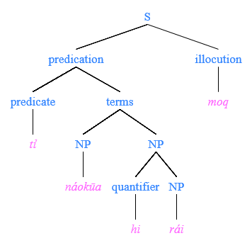

#### 用于Toaq声调标记的AutoHotkey脚本

如果某人的操作系统没有良好的组字功能，那么输入Toaq可能是一个挑战。对于这些人来说，使用AutoHotkey脚本是一个很好的选择，为了方便起见，这里提供了一个。

[点击这里](http://toaq.org/toaq_ansi.ahk)获得该脚本（用于AutoHotkey 1.0.\*版本），或者[点击这里](http://toaq.org/toaq_unicode.ahk)（用于1.1.\*及以上版本）。

当这个脚本运行时，特定的 /元音+其他符号/ 组合会自动转换为带有相应附加符号的元音。该脚本同时支持ASCII声调标记和声调编号。表格列出了这些组合：

|      | +    | =    |
| :--- | :--- | ---- |
| a    | -    | ā    |
| a    | /    | á    |
| a    | V    | ǎ    |
| a    | ?    | ả    |
| a    | ^    | â    |
| a    | \    | à    |
| a    | ~    | ã    |

|      | +    | =    |
| :--- | :--- | ---- |
| a    | 1    | ā    |
| a    | 2    | á    |
| a    | 3    | ǎ    |
| a    | 4    | ả    |
| a    | 5    | â    |
| a    | 6    | à    |
| a    | 7    | ã    |

这些组合可以改变，新的组合可以通过编辑脚本添加。

### 全声调短句

由于Toaq的灵活性，想出包含八个声调的句子是比较容易的。这里有三个例子，对练习发音或作为记忆声调与功能对应关系可能很有用。

| 声短一 | Jẽo	bi	dảqmīq	mâi	ràq	póq	jǐ.              | 声短二 | Kảı	nãı	póq	nǐeshūe	kùı	kôa	ba.            | 声短三 | Hó	lǎo	nãi	rào	rûqshūa	pa	rỏq.             |
| ------ | ------------------------------------------------------------ | ------ | ------------------------------------------------------------ | ------ | ------------------------------------------------------------ |
|        | truly	prenex	eternal	that.love	pertaining.to	the.person	which.is.me |        | write	now	the.people	who.stay.inside	because	that.cold	IMP |        | they	who.wait	now	when	it.rains	end.prenex	weep |
|        | *"Truly, eternal is the love of the person that is me."*     |        | *"May the people who are staying inside due to it being cold write now."* |        | *"They who now wait while it is raining weep."*              |

编写全声调短句也是Toaq语言和文化特有的一种诗歌艺术形式，很像日语中的俳句。由于Toaq允许许多不同的词序和短语，所以写一首全声调短句并不难，但写一首令人难忘的全声调短诗是一门艺术。

## 终言

至此，对Toaq的介绍结束。有兴趣的读者可能会有许多后续问题，而这些问题在上面的描述中没有涉及，或者他们可能只是渴望了解更多，或与其他Toaq学习者联系。有多种选择：

- Toaq 语[subreddit](https://www.reddit.com/r/Toaq)
- Toaq 语 [Discord 频道](https://discord.gg/qDqDsH9)
- Toaq 语 [Telegram 群组](https://t.me/joinchat/CWpuWUMl0JeW7-TdO6PnAQ)

(Discord频道和Telegram群组是通过网桥连接的，所以只需加入其中一个即可)

Toaq目前处于公开测试版，这意味着仍然可以进行某些调整，包括语言，更包括本页的文档。因此，你的意见和问题对于帮助磨平一些剩余的棱角非常重要。

作者希望读者能在学习Toaq语中找到乐趣。

**Nỉqgūo jĩa chêo gẻq ba!**

*© 2017 by Miles Forster aka solpahi. The contents of this website are licensed under the CC BY-NC-SA 4.0 license.*